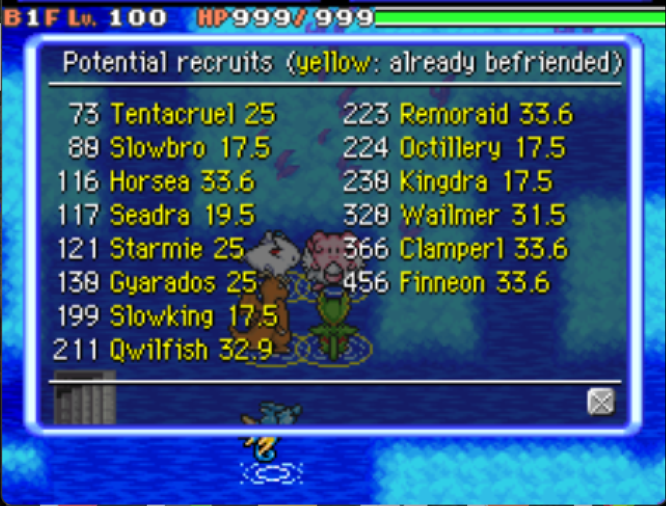

### Show Recruit Rates

Modifies the in-dungeon **Others > Recruitment search** menu to show calculated recruitment rate percentages next to each Pokémon's name.  The shown recruit rates take all types of recruit rate boosts into account, including:
- Party leader level
- Items (Friend Bow, Golden Mask, Amber Tear, Fiery Drum, etc.)
- Fast Friend IQ skill

This Patch requires the ExtraSpace patch.

*This image preview shows that Tentacruel has a 25% chance to be recruited on defeat.*
